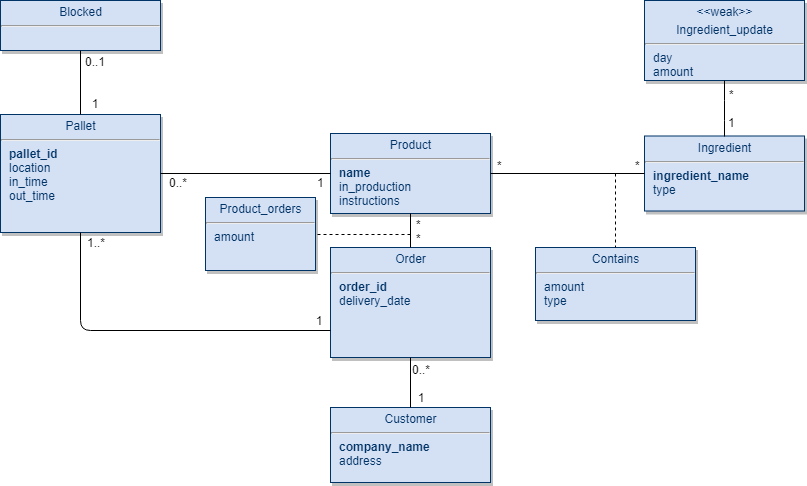

# EDAF75, project report

This is the report for

 + Jan Svensson, `elt12jsv`
 + Luke Postema, `elt14lpo`
 
We solved this project on our own, except for:

 + The Peer-review meeting
 + ... describe any other help you've gotten ...


## ER-design

The model is in the file [`er-model.png`](er-model.png):

<center>
    
</center>

(Our own ER-model).


## Relations
+ blocked(**_pallet_id_**)
+ pallets(**pallet_id**, _name_, location, intime, outtime, _order_id_)
+ products(**name**, in_production, instructions)
+ product_orders(**_name_**, amount, **_order_id_**)
+ customers(**company_name**, address)
+ orders(**order_id**, delivery_date, company_name)
+ contains(**_product_name_**, **_ingredient_name_**, amount, type)
+ ingredients(**name**, type)
+ ingredient_updates(**_ingredient_name_**, day, amount)

## Scripts

The program can be compiled by running the scripts from the makefile. Below follows a list of the different commands.

### Building and running the project

For generating the database
```shell
make generate-db
```

For compiling the java files
```shell
make compile
```

For running the program
```shell
make run
```

For building the entire project one can simply type
```shell
make all
```

For removing compiled files and generated databases
```shell
make clean
```

<hr>

## How to use the program

The application consists of 3 windows.

In the first window the user can inspect and update the storage of any ingredient as well as adding a new one.
A new ingredient is added by clicking 'Add new ingredient' and filling in the information. An ingredient is updated
by first selecting it from the list, filling in the bottom field and clicking 'Update'.

It is also possible to inspect different recipes by switching to the 'Recipes' tab. Each recipe can be inspected and updated
by first clicking the 'Update' button to the left, changing the amount and clicking 'Save'.
A new ingredient is added to the recipe by clicking 'New Ingredient'. Each ingredient can be removed by clicking 'Remove' next to it.

The second window handles Orders and Customers. Here, orders can be inspected by first filtering by the start and end dates and
selecting the order from the list. The products and the amount will be shown below.
Customers can be listed in the same way by switching to the 'Customer' tab.

Finally, the last window handles the pallets. They are listed the same way as orders but with the ability to filter on products.
To block a pallet, the user simply clicks on the pallet he wishes to block and selects 'Yes'.
In the blocked tab all the blocked pallets are listed. To unblock a pallet the user clicks on the desired pallet and selects 'Yes'.
For producing pallets the user must head to the 'Production' tab. Here the pallet number is scanned in as well as product selected from the drop down list. If there are any problems with producing a pallet a message will be shown just under the 'Scan in' button.
